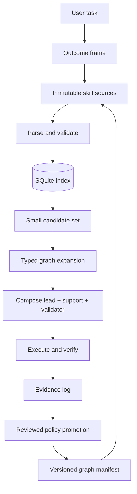

# Architecture

## Objective

Build a dependable control plane for a graph of Agent Skills while preserving the Agent Skills specification and minimizing context use.

## Layers

### Source layer

Each skill directory is authoritative. The indexer reads only `SKILL.md` files. The graph manifest contains relationships that cannot be expressed cleanly in standard skill frontmatter. Hashtags in the body are lightweight discovery facets, not proof of compatibility.

### Validation layer

Validation happens before any database mutation. It checks:

- required frontmatter delimiters;
- official name and description constraints;
- directory/name agreement;
- duplicate names;
- malformed manifest data;
- missing relation targets and self-edges;
- optional warnings for oversized or weakly described skills.

### Index layer

A single SQLite database contains:

- `skills`: identity, path, hash, description, metadata, body;
- `tags` and `skill_tags`: normalized hashtag facets;
- `edges`: typed directed relationships;
- `skills_fts`: full-text search when FTS5 is available;
- `meta`: schema version, source root, index time, and capabilities.

The refresh is one transaction. A parse or validation failure leaves the previous database untouched. A successful transaction replaces the prior snapshot, preventing half-indexed graphs.

### Retrieval layer

The hot path is:

1. lexical candidate retrieval;
2. stopword removal and exact-token matching to reduce prefix false positives;
3. minimum query-token coverage for activation, with exact-name override;
4. optional tag/domain/confidence filters;
5. small top-k result and separately selected lead;
6. optional one- or two-hop typed expansion;
7. semantic role assignment and full-skill loading.

The agent should see evidence and paths, not the entire body. Graph expansion is depth-limited and cycle-safe.

### Learning layer

Execution outcomes feed an append-only evidence log. Candidate lessons are promoted into policy only after recurrence or safety significance. This separates observations from rules and makes regressions detectable.

## Scale model

SQLite handles millions of rows well when access is index-backed and queries return small result sets. The design remains stable by avoiding:

- one huge Markdown catalog in context;
- eager loading of all skill bodies;
- unbounded recursive traversal;
- many tags per skill;
- mutable global JSON state;
- ranking numbers presented as objective truth.

When a collection exceeds one writer or needs independent access control, create corpus-specific immutable indexes and a small federation/router layer. SQLite files should not be shared concurrently over network filesystems.

## Failure modes and controls

| Failure | Detection | Control |
|---|---|---|
| Duplicate skill names | validation | fail before indexing |
| Stale index | content hashes vs `meta.manifest_sha256` and indexed rows | run `check` before routing |
| Generic-token false activation | no-trigger evaluation cases and coverage threshold | keep the lead empty when evidence is weak |
| Malformed YAML/frontmatter | parser | fail closed with path and line |
| Broken graph target | manifest validation | reject transaction |
| Hash collision by rename | unique name + path audit | review move as identity change |
| Overbroad retrieval | explain output + no-trigger tests | filters and top-k cap |
| Context explosion | selected-skill count | lead + ≤3 support + validator |
| Policy overfit | minimum evidence rule | holdout tasks and rollback |
| FTS5 unavailable | capability check | fallback search + warning |
| Concurrent writers | operational policy | one writer or service migration |

## Security and privacy

- Treat skill text and manifests as untrusted input during indexing.
- Do not execute code found while scanning.
- Never resolve path-like tags as filesystem paths.
- Keep query output bounded.
- Do not store secrets in descriptions, hashtags, or examples.
- Review newly connected skills before routing to them; a high lexical score is not a trust score.
- Require explicit authorization for tools or deployment actions named by a skill.
