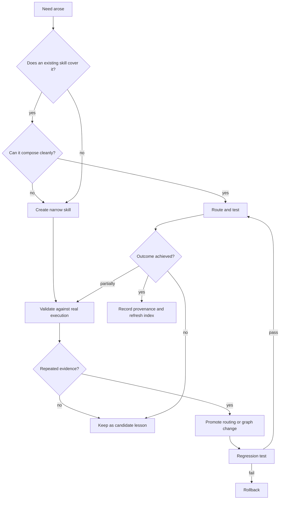

# Decision Log

This is an auditable rationale and verification map, not a transcript of private reasoning. Future changes should append a dated decision with evidence and rollback conditions.

## Decision flow

## Decisions

### D1 — Keep `SKILL.md` canonical

**Decision:** index standard skill directories and keep graph relations in a versioned overlay.

**Why:** compatibility and portability matter more than putting every edge in nonstandard frontmatter.

**Rejected:** database-only source of truth, because it makes recovery, review, and export harder.

**Rollback condition:** the official specification gains a stable relationship model that covers typed graph edges.

### D2 — Use SQLite rather than a catalog in context

**Decision:** index millions of rows in SQLite and return only a small top-k set.

**Why:** a single generated catalog would consume context and become stale. SQLite provides durable, bounded retrieval with no service dependency.

**Rejected:** vector-only search, because it is weaker for exact identifiers and unavailable offline without model dependencies. Hybrid retrieval can be added later as a ranking feature, never as the only source of truth.

### D3 — Prefer FTS5, retain a fallback

**Decision:** detect FTS5 and use a compatibility search path when absent.

**Why:** most maintained SQLite builds include FTS5, but Python builds vary. A silent hard failure would make the skill fragile.

**Rejected:** requiring a third-party search package, which harms portability.

### D4 — Snapshot replacement in one transaction

**Decision:** parse and validate all sources before replacing index rows in a transaction.

**Why:** agents must never route through a half-updated graph.

**Rejected:** incremental row-by-row refresh as the default, because it complicates deletion and consistency. Incremental indexing can be added with a content-hash journal.

### D5 — Typed graph edges plus small hashtag facets

**Decision:** hashtags describe topics; edges describe operational relationships.

**Why:** similarity is not compatibility. A deployment skill and a UI skill may share `#performance` yet must not be composed automatically.

**Rejected:** freeform `#related-to` links as the primary graph, because they become noisy and untestable.

### D6 — Bound composition

**Decision:** prefer one lead, at most three support skills, and one validator per route.

**Why:** instruction conflicts and context growth rise quickly with skill count.

**Rejected:** “load all relevant skills,” which is neither measurable nor safe.

### D7 — Promote lessons with evidence thresholds

**Decision:** log every observation; promote repeated patterns or safety-critical failures into policy.

**Why:** one outcome is weak evidence and can overfit the router.

**Rollback condition:** never; evidence thresholds may be relaxed only for a documented emergency and with a sunset review.

### D8 — Measure routing with positive and negative cases

**Decision:** maintain small JSON evaluation cases containing expected results and forbidden results, including explicit no-trigger cases.

**Why:** hit rate alone hides over-activation. A router that activates a deployment skill for a poem is unsafe even if it performs well on relevant queries.

**Metrics:** hit rate, mean reciprocal rank, top-3 hit rate, selected-result forbidden rate, and no-trigger false-activation rate. Candidate retrieval may return related alternatives, but the selected lead must never be forbidden. Treat a regression as a routing defect even when a full task happens to succeed.

### D9 — Check freshness before routing

**Decision:** store source and manifest hashes in the index and expose a `check` command.

**Why:** a correct index built from old skills is still wrong. Freshness is a separate quality dimension from ranking quality.

**Rollback condition:** remove the check only if an external content-addressed source guarantees immutability and freshness.

## Regression matrix

| Capability | Positive test | Negative/edge test | Required invariant |
|---|---|---|---|
| Frontmatter parser | metadata and body | missing delimiter, bad indentation | invalid source never mutates DB |
| Official validation | valid nested skill | uppercase, mismatch, duplicate | fail before index |
| Hashtags | mixed-case tags | Markdown headings, long tags | normalized and bounded |
| Manifest | typed edge | missing target, self-edge, bad confidence | whole transaction rejected |
| Search | exact skill name | unrelated query, tag filter | top-k and explanation |
| Neighbors | two-hop relation | cycle, direction, depth cap | terminates and preserves direction |
| Refresh | changed content hash | malformed new skill | atomic replacement |
| Routing policy | real trigger | near-miss no-trigger | no over-triggering |
| Evaluation | expected skill in top-k | forbidden/no-trigger result | measurable hit and false-activation rates |
| Freshness | unchanged sources and manifest | changed source or manifest | `check` fails closed |

## Change protocol

1. Write a failing fixture or query.
2. Make the smallest change.
3. Run `python -m unittest discover -s tests -v`.
4. Run the real query that motivated the change.
5. Record evidence, confidence, and known limitations.
6. Version the change and define a rollback signal.
